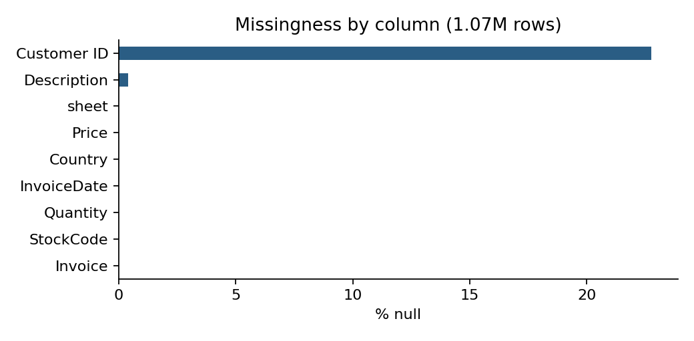
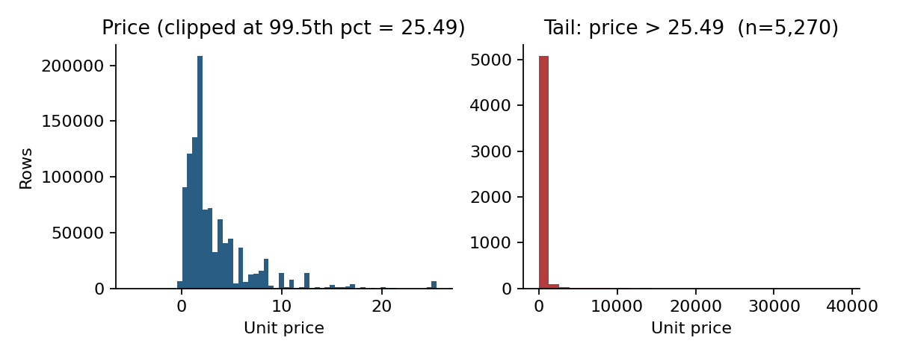

**Nandish Mahadev Karki** · nkarki2791@gmail.com · [linkedin.com/in/nandish-karki](https://linkedin.com/in/nandish-karki) · Magdeburg, Germany
*Submission for PRYZM Data Integration Intern take-home*
*Live interactive demo: [pryzm-data-integration-task.streamlit.app](https://pryzm-data-integration-task.streamlit.app/) · Code: [github.com/Nandish-Karki/pryzm-data-integration-task](https://github.com/Nandish-Karki/pryzm-data-integration-task)*

## TL;DR

**Across 1,067,371 rows of the UCI Online Retail II dataset, 25.6% of rows fail at least one High-severity or Blocker check; 22.8% have no `Customer ID`, and a `currency` column is absent entirely. I propose a 12-field intake specification — enforced in code via a pandera schema — plus six automated ingestion checks. The one improvement I would ship first is automated cancellation reconciliation + non-product-code filtering, which together account for 8.5% of nominal gross revenue and must be resolved before a pricing model can learn a truthful target.**

## 1 · Data quality findings

**Dataset:** `online_retail_II.xlsx`, two sheets (`Year 2009-2010`, `Year 2010-2011`), 1,067,371 rows, period 2009-12-01 → 2011-12-09, 53,628 invoices, 5,304 stock codes, 5,942 customers, 43 countries.

I organised checks along six quality dimensions and framed every finding by its **pricing-model impact** rather than as an abstract defect. All numbers below are reproduced by `notebooks/02_quality_assessment.ipynb` (see `output/dq_results.csv`).

### Severity-ranked findings

| Dimension | Check | Failing rows | % of total | Severity | Pricing-model impact |
|---|---|---:|---:|---|---|
| Validity | Currency column absent | 1,067,371 | 100.00% | **Blocker** | 43 countries in the data; without an explicit currency column, GBP / EUR / USD are silently mixed as if comparable. |
| Completeness | `Customer ID` is null | 243,007 | 22.77% | **Blocker** | Customer-level elasticity and retention segmentation both require a stable customer key. No safe imputation. |
| Uniqueness | Exact duplicate rows | 12,133 | 1.14% | High | Duplicates inflate both revenue and volume, biasing aggregation-based features. |
| Validity | `Price <= 0` | 6,207 | 0.58% | High | Non-positive unit prices contaminate the price distribution and bias learned elasticity. |
| Anomaly | Non-product stock codes (`POST`, `DOT`, `BANK CHARGES`, `M`, `AMAZONFEE`, `TEST`, …) | 5,810 | 0.54% | High | Fees and adjustments share the transactional schema but are not products; leaving them in dominates the training loss. |
| Integrity | Negative quantity on a non-cancellation invoice | 3,457 | 0.32% | High | Outside the `C`-prefix convention, negative quantities are ambiguous — returns, corrections, and data errors become indistinguishable. |
| Integrity | Cancellation rows with no matching original purchase | 2,234 | 0.21% | High | Unmatched cancellations either inflate returns or indicate lost origin records; either way, net-revenue features are wrong. |
| Consistency | StockCodes with multiple distinct descriptions | 420,566 | 39.40% | Medium | Description drift on the same SKU signals upstream master-data inconsistency and breaks text-based features. |
| Uniqueness | Duplicate `(Invoice, StockCode)` pairs | 88,585 | 8.30% | Medium | Multiple lines of the same SKU on one invoice should be consolidated with summed quantity. |
| Consistency | StockCode casing / whitespace variants for the same product | 66,980 | 6.28% | Medium | Same product under multiple SKU strings splits price-history and demand signal. |
| Completeness | `Description` is null or empty | 8,764 | 0.82% | Medium | Blocks product clustering and human review of anomalies. |
| Anomaly | Price > 99.99th percentile (£2,555.82) | 107 | 0.01% | Low | Manual-adjustment outliers at £10k+ skew log-transformed features. |

Two guardrail checks (`Price is null`, `Quantity == 0`) returned zero failing rows and are kept in the suite for future handovers.

### Visual summary

{ width=60% }

{ width=85% }

### What this blocks

A useful B2B pricing model needs three things the raw handover does not provide: (a) a stable **customer key** (missing for 22.8% of rows), (b) an explicit **currency** per transaction (missing entirely — 13.9% of rows are non-UK), and (c) a clean **product universe** with non-product codes stripped and cancellations reconciled. Of the gross nominal revenue of £19.29M across the two years, cancellations account for −£1.53M and non-product codes account for a further −£0.11M — together ≈8.5% of headline revenue that must be classified correctly before any elasticity, mix, or margin model is trained. The 6.3% SKU casing variants and 39.4% SKUs with drifting descriptions fragment the product dimension itself: without a normalisation layer, the same product appears as several distinct SKUs and its price history is silently split.

## 2 · Proposed intake specification

The spec is delivered in two forms. First, a one-page table a non-technical customer can fill in:

| Field | Type | Required? | Format / Enum | Example | Automated check at ingestion |
|---|---|---|---|---|---|
| `invoice_id` | string | Yes | ≤32 chars, uppercase / digits / hyphen | `INV-0001` | Regex + uniqueness across file |
| `line_id` | string | Yes | Unique with `invoice_id` | `1` | Composite-key uniqueness |
| `sku_id` | string | Yes | Uppercase alphanumeric, 2–32 chars | `SKU-22423` | Regex + normalisation audit |
| `product_description` | string | Yes | Non-empty | `WHITE HANGING HEART T-LIGHT HOLDER` | Non-empty + consistency per SKU |
| `quantity` | integer | Yes | Non-zero; negative only if `is_cancellation=true` | `6` | Range + cancellation-coherence check |
| `unit_price` | decimal | Yes | ≥ 0 | `2.55` | Range + outlier flag |
| `currency` | ISO-4217 | Yes | 3-letter code | `GBP` | Enum limited to customer's declared currencies |
| `invoice_datetime` | ISO-8601 | Yes | UTC or with offset | `2010-12-01T08:26:00Z` | Range vs declared business period |
| `customer_id` | string | Conditional | Required for named customers | `17850` | Null permitted only for anonymous walk-in |
| `country` | ISO-3166-1 alpha-2 | Yes | 2-letter code | `GB` | Enum check |
| `is_cancellation` | boolean | Yes | Default `false` | `false` | Cross-field coherence with negative quantity |
| `original_invoice_id` | string | Conditional | Required if `is_cancellation=true` | `INV-0001` | Referential integrity to `invoice_id` |

Second, the same spec is enforced in code as a pandera `DataFrameSchema` in [`src/intake_schema.py`](../src/intake_schema.py). The schema validates on ingestion and, on failure, returns a row-level report of violations — identical to what PRYZM's engineers currently produce by hand.

### Six automated checks run at ingestion

1. **Schema validation** — types, nullability, enums (pandera).
2. **Range checks** — `unit_price ≥ 0`; `quantity ≠ 0`; `invoice_datetime` within the customer's declared business period.
3. **Referential integrity** — every row with `is_cancellation=true` resolves to an `original_invoice_id` that exists.
4. **Duplicate detection** — composite uniqueness on `(invoice_id, line_id)`.
5. **SKU normalisation audit** — report SKUs that differ only by casing or whitespace; fuzzy near-duplicate report for v2.
6. **Volume sanity bounds** — total row count and date span compared against what the customer declares in the onboarding form; a divergence > 5% is flagged for human review.

The notebook demonstrates both directions: a valid row passes, a raw-style row (`sku_id='85123a'`, `unit_price=-1.5`, `currency='gbp'`, `country='United Kingdom'`, `quantity=0`) fails with five distinct violations captured.

## 3 · Priority improvement: automated cancellation reconciliation + non-product filtering

**The problem.** Two classes of transaction contaminate the revenue signal a pricing model would train on: (i) cancellations — 19,494 rows prefixed with `C`, of which 2,234 have no matching original purchase for the same customer and SKU, and (ii) non-product stock codes — 5,810 rows using codes such as `POST`, `DOT`, `BANK CHARGES`, `M`, `AMAZONFEE`, `TEST`, `ADJUST`. Together they explain roughly £1.64M (≈8.5%) of nominal gross revenue. Leaving them in produces two different failure modes: orphan cancellations show up as unexplained demand drops, while fee lines show up as products whose "price" is wildly outside the distribution.

**Why ship this first.** Every other improvement — normalisation, missing-customer imputation, currency handling — compounds on top of a clean revenue baseline. This change is also the one with the clearest before/after metric for a non-technical stakeholder: *net revenue after reconciliation, Δ% vs the raw file*.

**v1 design (3–5 days, intern-scoped).**

- **Pipeline position.** A new stage between raw ingestion and the pricing-model feature store, reading the validated intake dataframe and writing a `clean_transactions` table plus a `reconciliation_report` table.
- **Cancellation matching.** For each cancellation row, match on `(customer_id, sku_id, unit_price)` against the preceding 180 days of purchases for the same customer; apply FIFO offset to purchase quantities. Rows that cannot be matched are tagged `unmatched_cancellation` and surfaced in the report, not silently dropped.
- **Non-product filtering.** Maintain a versioned `non_product_codes.yaml` (seeded from the codes above) and route rows matching it to a `non_product_ledger` table instead of the product stream. Per-customer overrides supported.
- **Outputs.** Two tables and a one-page markdown report per customer: before/after gross, cancellation match rate, number of `non_product` rows, unmatched-cancellation sample, and any new non-product codes seen that are not yet in the YAML.
- **Success metric.** Match rate ≥ 90% of cancellation rows; unmatched share < 3% of transactions; before/after gross delta reported and signed off by the onboarding lead.

**v2 (later).** Extend to fuzzy-matched cancellations (where price or SKU drifted between purchase and return), plug the reconciliation report into Grafana, and generalise the non-product YAML to a per-customer plug-in so pharma-specific adjustment codes (regulatory recalls, sample dispenses) can be handled without code changes.

## Appendix · Reproducibility

Clone the repo, `pip install -r requirements.txt`, drop `online_retail_II.xlsx` into `data/`, and run `jupyter nbconvert --to notebook --execute notebooks/02_quality_assessment.ipynb` — every number in this document is emitted by that notebook. The intake schema is executable: `from src.intake_schema import validate`.
